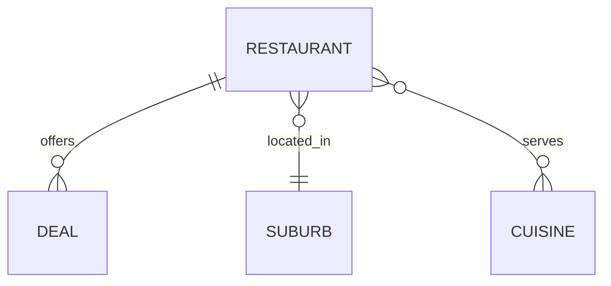

# Restaurant Deals API — Engineering Challenge

This project implements three tasks:

1. **Task 1 — Active Deals API**  
   Returns all restaurant deals that are active at a specified time of day.

2. **Task 2 — Peak Time Window API**  
   Calculates the time period during which the largest number of deals overlap.

3. **Task 3 — Database Schema Design**  
   A database-ready schema and ERD for storing restaurant, cuisine, suburb and deal data.

The system loads data from:

🔗 https://eccdn.com.au/misc/challengedata.json

and normalises it into a clean, strongly-typed domain model.

---

# 1. Overview

This API processes real-world restaurant and deal data, normalises inconsistent time formats, and exposes clean REST endpoints backed by a relational schema.

Key features:

- Strongly typed `LocalTime`, `boolean`, and `int` values
- Flexible parsing of input times (`"10:30"` and `"3:00pm"`)
- Clean output times in 24-hour format
- Normalised deal time windows
- H2 in-memory database
- Fully test-driven development (TDD)

---

# 2. Architecture

## Summary
**Tech stack:**
- Java 21
- Spring Boot (Web + Data JPA)
- Maven
- H2 database
- JUnit 5 + Spring Boot Test

**Design principles:**
- Strong domain modelling
- Clean separation of loader, domain, service and API layers
- TDD with unit tests for parsing, normalisation, filtering and peak calculations


## Architecture

This project is a small Spring Boot 3 REST API that exposes restaurant deals from a static JSON feed,
loads them into an in-memory database, and provides query + peak-time calculations.

It follows a simple layered architecture:

- **API layer** (`api`) – HTTP controllers and response DTOs
- **Service layer** (`service`) – business logic, filtering and peak time calculations
- **Domain layer** (`domain`) – core domain models used inside the service layer
- **Persistence layer** (`persistence`, `repository`) – JPA entities and Spring Data repositories
- **Infrastructure / config** (`config`, `loader`) – application wiring and data bootstrapping

### Project layout

From `src/main/java/au/com/eatclub/challenge`:

```text
challenge
├── RestaurantDealsApplication.java      # Spring Boot entry point
├── api
│   ├── DealController.java              # REST endpoints for deals + peak time
│   ├── DealResponse.java                # DTO returned by /deals API
│   ├── PeakTimeResponse.java            # DTO returned by /deals/peak-time API
│   └── GlobalExceptionHandler.java      # Centralised exception->HTTP response mapping
├── service
│   ├── DealService.java                 # Core business logic
│   └── DealFilter.java                  # Reusable filtering helpers for deals
├── domain
│   ├── ChallengeData.java               # Representation of full JSON feed
│   ├── Deal.java                        # Domain model used by the service layer
│   └── Restaurant.java                  # Domain model used by the service layer
├── persistence
│   ├── CuisineEntity.java               # JPA entities persisted in the DB
│   ├── DealEntity.java
│   ├── RestaurantEntity.java
│   └── SuburbEntity.java
├── repository
│   ├── CuisineRepository.java           # Spring Data JPA repositories
│   ├── DealRepository.java
│   ├── RestaurantRepository.java
│   └── SuburbRepository.java
├── loader
│   └── DataLoader.java                  # Loads challengedata.json into the DB on startup
└── config
    └── WebClientConfig.java             # WebClient / infrastructure configuration
```

**src/main/resources:**

```text
resources
├── application.yaml                     # Application + DB configuration
├── static/                              # (reserved for static assets – unused)
└── templates/                           # (reserved for server-side views – unused)
```

**src/test/java/au/com/eatclub/challenge:**
```text
challenge
└── api
    └── DealControllerTest.java          # Web layer tests (MockMvc)
└── service
    ├── DealFilterTest.java              # Unit tests for filtering helpers
    ├── DealServicePeakTimeTest.java     # Unit tests for peak time calculation
    └── DealServiceTest.java             # Unit tests for deal retrieval / filtering
```

### Layer responsibilities

#### API layer (api)
- Exposes the main HTTP endpoints, for example:
  - `GET /api/deals` – list deals, optionally filtered by time and other criteria.
  - `GET /api/deals/peak-time` – returns the peak time window during which most deals are available.
- Converts incoming HTTP parameters into service method calls.
- Maps internal domain objects into DTOs (`DealResponse`, `PeakTimeResponse`).
- Uses `GlobalExceptionHandler` (`@RestControllerAdvice`) to convert domain / validation errors into
consistent JSON error responses.

#### Service layer (service)
- Contains all business logic:
  - retrieving deals from the repositories,
  - applying filters (time window, restaurant, cuisine, etc),
  - computing the peak time window across all deals.
- `DealService` is the main entry point, called by the controller.
- `DealFilter` encapsulates common filtering rules so they are testable in isolation and reusable.

#### Domain layer (domain)
- Provides pure domain models used by the service layer (Deal, Restaurant, ChallengeData).
- These classes represent the business concepts without persistence annotations.
- Helps keep the service logic decoupled from database implementation details.

#### Persistence layer (persistence, repository)
- `Entity` classes define the relational model:
  - `RestaurantEntity ↔ DealEntity ↔ CuisineEntity ↔ SuburbEntity.`
- `Repository` interfaces extend Spring Data JPA to provide CRUD and query methods.
- The database is configured in `application.yaml` (H2 in-memory during development).

#### Infrastructure / bootstrapping (config, loader)
- `WebClientConfig` defines reusable HTTP clients for external calls (e.g. the JSON challenge feed).
- `DataLoader` runs at startup, fetches `challengedata.json`, converts it to domain / entities, and
persists it through the repositories so the API can query local data instead of hitting the remote
JSON on every request.

**Request flow**

```text
Client
  ↓ HTTP (JSON)
DealController (api)
  ↓
DealService (service)
  ↓
Repositories (repository)
  ↓
Database (persistence entities)
```

For the **peak time** endpoint:

```text
GET /api/deals/peak-time
  → DealController
  → DealService.calculatePeakTime()
      - loads all deals for the configured time range
      - computes the time window where the highest number of deals overlap
      - returns a PeakTimeResponse (start, end, count)
```

#### Testing strategy
- **Service tests** (`DealServiceTest`, `DealServicePeakTimeTest`, `DealFilterTest`) validate:
  - core business rules,
  - filtering behaviour,
  - correctness of the peak time algorithm.
- **Controller tests** (`DealControllerTest`) use Spring MVC test support (`MockMvc/WebTestClient`) to:
  - validate HTTP status codes,
  - JSON shape of responses, 
  - error handling contracts.

This structure keeps HTTP concerns, business rules, and persistence clearly separated while
remaining small and easy to understand for the purposes of the coding challenge.

---

# 3. Domain Model

## 3.1 Entities

### **Restaurant**
- `id` (PK)
- `objectId`
- `name`
- `address1`
- `imageLink`
- `openTime` (LocalTime)
- `closeTime` (LocalTime)
- `suburb` (FK → Suburb)
- Many-to-many with cuisines
- One-to-many with deals

### **Deal**
- `id` (PK)
- `objectId`
- `discount` (int)
- `dineIn` (boolean)
- `lightning` (boolean)
- `qtyLeft` (int)
- `availableFrom` (LocalTime, nullable)
- `availableTo` (LocalTime, nullable)
- `restaurant` (FK → Restaurant)

### **Suburb**
- `id` (PK)
- `name`

### **Cuisine**
- `id` (PK)
- `name`
- many-to-many with restaurants

---

## 3.2 Relationships (Mermaid ER Diagram)



## 3.3 Normalisation Rules

**Restaurant Times**

Incoming format: "3:00pm"
→ converted to LocalTime using custom parser.

**Deal Times**

Original fields:
- open
- close
- start
- end

These are inconsistent, so we normalise:

```
availableFrom = first non-null of (start, open)
availableTo   = first non-null of (end, close)
```

Both stored as `LocalTime`.


**Value Normalisation**
- `discount` → `int`
- `dineIn` and `lightning` → `boolean`
- `qtyLeft` → `int`


# 4. Time Parsing Rules

The system accepts both input formats:

### 1. 24-hour format

```
10:30
15:45
```

### 2. 12-hour am/pm format
```
3:00pm
11:20AM
```


Parser handles:
- upper/lowercase
- missing zeros ("3pm" → "15:00")
- "12:00am" → 00:00
- "12:00pm" → 12:00
- null or empty → null


# 5. Data Loading Process
1. Fetch JSON from: https://eccdn.com.au/misc/challengedata.json
2.	Convert raw JSON into DTO objects
3.	Normalise times using TimeParser & DealTimeNormalizer
4.	Insert into H2 database
5.	Expose via repository layer

# 6. Task 1 — Active Deals API

**Endpoint**

```
GET /deals?timeOfDay=10:30
```


**Input**
- `timeOfDay` is required
- `Accepts` either format:
    - "10:30"
    - "3:00pm"


**Output (24h format)**

``` json
{
    "deals": [
        {
        "restaurantObjectId": "...",
        "restaurantName": "...",
        "restaurantAddress1": "...",
        "restaurantSuburb": "...",
        "restaurantOpen": "13:00",
        "restaurantClose": "21:00",
        "dealObjectId": "...",
        "discount": 40,
        "dineIn": false,
        "lightning": true,
        "qtyLeft": 5
        }
    ]
}
```

### 6.1 Deal Matching Logic

A deal is active if:

``` java
restaurant.openTime <= timeOfDay <= restaurant.closeTime
AND
(availableFrom == null OR availableFrom <= timeOfDay)
AND
(availableTo   == null OR availableTo   >= timeOfDay)
AND qtyLeft > 0
```

# 7. Task 2 — Peak Time Window API

**Endpoint**

```
GET /peak-time
```

**Output**

``` json
{
  "peakTimeStart": "17:00",
  "peakTimeEnd": "21:00"
}
```

**Definition**

The peak time window is the **continuous** time interval during which the maximum number of deals overlap.

**Algorithm (Sweep Line Technique)**
1.	Collect all deal boundaries (availableFrom, availableTo).
2.	Mark each “start” as +1, each “end” as –1.
3.	Sort all events by time.
4.	Accumulate running overlap count.
5.	Find the longest interval where the count == maximum.

This is fully deterministic and reproducible.


# 8. Task 3 — Database Schema Design (H2)

**Chosen Database: H2**

**Reasoning:**
- In-memory, perfect for fast iteration and TDD
- Zero setup, works out-of-the-box with Spring Boot
- Supports relational integrity and indexing
- Ideal for code challenges and local prototyping


### 8.1 SQL Schema (DDL)
``` sql
CREATE TABLE suburb (
    id BIGINT AUTO_INCREMENT PRIMARY KEY,
    name VARCHAR(255) NOT NULL
);

CREATE TABLE cuisine (
    id BIGINT AUTO_INCREMENT PRIMARY KEY,
    name VARCHAR(255) NOT NULL
);

CREATE TABLE restaurant (
    id BIGINT AUTO_INCREMENT PRIMARY KEY,
    object_id VARCHAR(255),
    name VARCHAR(255),
    address1 VARCHAR(255),
    image_link VARCHAR(1000),
    open_time TIME NOT NULL,
    close_time TIME NOT NULL,
    suburb_id BIGINT,
    FOREIGN KEY (suburb_id) REFERENCES suburb(id)
);

CREATE TABLE restaurant_cuisine (
    restaurant_id BIGINT NOT NULL,
    cuisine_id BIGINT NOT NULL,
    PRIMARY KEY (restaurant_id, cuisine_id),
    FOREIGN KEY (restaurant_id) REFERENCES restaurant(id),
    FOREIGN KEY (cuisine_id) REFERENCES cuisine(id)
);

CREATE TABLE deal (
    id BIGINT AUTO_INCREMENT PRIMARY KEY,
    object_id VARCHAR(255),
    discount INT,
    dine_in BOOLEAN,
    lightning BOOLEAN,
    qty_left INT,
    available_from TIME,
    available_to TIME,
    restaurant_id BIGINT NOT NULL,
    FOREIGN KEY (restaurant_id) REFERENCES restaurant(id)
);
```

# 9. Testing Strategy (TDD)

**Unit Tests**
- `TimeParserTest`
- `DealTimeNormalizerTest`
- `DealFilterTest`
- `PeakTimeCalculatorTest`

**Integration Tests**
- `DealControllerTest`
- `PeakTimeControllerTest`
- Repository/H2 loading tests

**Each feature is written using the TDD cycle:**
1.	Write failing test
2.	Implement minimal code
3.	Refactor
4.	Repeat


# 10. Build & Run
``` shell
mvn clean install
mvn spring-boot:run
```

H2 Console
```
http://localhost:8080/h2-console
```

# 11. Future Enhancements
- Pagination
- Filtering by suburb or cuisine
- Caching peak time window
- Swagger/OpenAPI documentation
- Dockerised deployment

# 12. Code Coverage (JaCoCo)

This project uses **JaCoCo** for measuring automated test coverage.

**Generate coverage locally:**

``` shell 
mvn clean test
mvn jacoco:report
```

HTML report output:

```text
target/site/jacoco/index.html
```

Open on macOS:

``` shell
open target/site/jacoco/index.html
```

# 13. GitHub CI Pipeline

Continuous Integration runs automatically on every push and pull request to `main`.

Pipeline URL:
https://github.com/carlos-brgan/restaurant-deals-api/actions

The workflow runs:
- `mvn clean verify`
- All unit + integration tests
- JaCoCo test coverage
- Uploads reports as artifacts

# 14. Task 2 — Peak Time Window (Overall Explanation)

The goal of Task 2 is to compute the continuous period of the day during which the highest number of restaurant deals are active at the same time. Unlike Task 1, which answers “what is active right now?”, Task 2 answers a global question:

“When is activity at its highest across the entire dataset?”

This is more complex than it appears because deal availability in the JSON feed is inconsistent. Deals may define:
- start / end
- or open / close
- or neither (inherit restaurant hours)
- or be missing entirely (treated as always-active)
- or wrap past midnight (20:00 → 02:00)
- and end-times are exclusive

Because of these variations, determining the true overlap requires normalising all deal windows into a consistent format.

To solve this efficiently and deterministically, the API uses a sweep-line algorithm, a classic technique for interval overlap problems:
1.	Convert each deal into two events:
- (start, +1) → deal becomes active
- (end, -1) → deal becomes inactive
2. Sort all events by time.
3. Sweep through the timeline once, keeping a running count of active deals.
4. Whenever this count reaches the current maximum, record the start of a new peak window.
5. The next event’s timestamp becomes the end of that window.

This handles all edge cases:
- wrap-around windows
- missing times
- cascading overlaps
- exclusive end times
- multiple windows with the same maximum

If more than one interval shares the same peak overlap, the algorithm returns the most recent interval where that peak occurs, producing stable and intuitive results.

The final output is a simple JSON object:

```json
{
  "peakTimeStart": "17:00",
  "peakTimeEnd": "21:00",
  "count": 12
}
```

representing the time window during which deal activity is at its highest.

### Database console http://localhost:8080/h2-console/