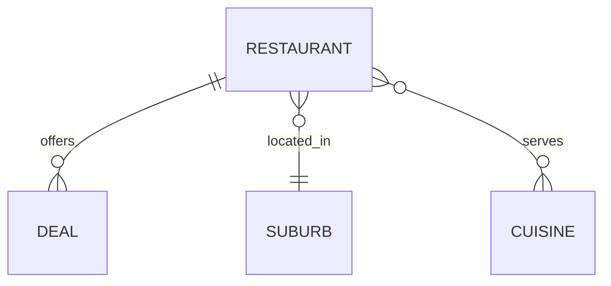

# Restaurant Deals API — Engineering Challenge

This project implements three tasks:

1. **Task 1 — Active Deals API**  
   Returns all restaurant deals that are active at a specified time of day.

2. **Task 2 — Peak Time Window API**  
   Calculates the time period during which the largest number of deals overlap.

3. **Task 3 — Database Schema Design**  
   A database-ready schema and ERD for storing restaurant, cuisine, suburb and deal data.

The system loads data from:

🔗 https://eccdn.com.au/misc/challengedata.json

and normalises it into a clean, strongly-typed domain model.

---

# 1. Overview

This API processes real-world restaurant and deal data, normalises inconsistent time formats, and exposes clean REST endpoints backed by a relational schema.

Key features:

- Strongly typed `LocalTime`, `boolean`, and `int` values
- Flexible parsing of input times (`"10:30"` and `"3:00pm"`)
- Clean output times in 24-hour format
- Normalised deal time windows
- H2 in-memory database
- Fully test-driven development (TDD)

---

# 2. Architecture Summary

**Tech stack:**
- Java 21
- Spring Boot (Web + Data JPA)
- Maven
- H2 database
- JUnit 5 + Spring Boot Test

**Design principles:**
- Strong domain modelling
- Clean separation of loader, domain, service and API layers
- TDD with unit tests for parsing, normalisation, filtering and peak calculations

---

# 3. Domain Model

## 3.1 Entities

### **Restaurant**
- `id` (PK)
- `objectId`
- `name`
- `address1`
- `imageLink`
- `openTime` (LocalTime)
- `closeTime` (LocalTime)
- `suburb` (FK → Suburb)
- Many-to-many with cuisines
- One-to-many with deals

### **Deal**
- `id` (PK)
- `objectId`
- `discount` (int)
- `dineIn` (boolean)
- `lightning` (boolean)
- `qtyLeft` (int)
- `availableFrom` (LocalTime, nullable)
- `availableTo` (LocalTime, nullable)
- `restaurant` (FK → Restaurant)

### **Suburb**
- `id` (PK)
- `name`

### **Cuisine**
- `id` (PK)
- `name`
- many-to-many with restaurants

---

## 3.2 Relationships (Mermaid ER Diagram)



## 3.3 Normalisation Rules

**Restaurant Times**

Incoming format: "3:00pm"
→ converted to LocalTime using custom parser.

**Deal Times**

Original fields:
- open
- close
- start
- end

These are inconsistent, so we normalise:

```
availableFrom = first non-null of (start, open)
availableTo   = first non-null of (end, close)
```

Both stored as `LocalTime`.


**Value Normalisation**
- `discount` → `int`
- `dineIn` and `lightning` → `boolean`
- `qtyLeft` → `int`


## 4. Time Parsing Rules

The system accepts both input formats:

### 1. 24-hour format

```
10:30
15:45
```

### 2. 12-hour am/pm format
```
3:00pm
11:20AM
```


Parser handles:
- upper/lowercase
- missing zeros ("3pm" → "15:00")
- "12:00am" → 00:00
- "12:00pm" → 12:00
- null or empty → null


## 5. Data Loading Process
1. Fetch JSON from: https://eccdn.com.au/misc/challengedata.json
2.	Convert raw JSON into DTO objects
3.	Normalise times using TimeParser & DealTimeNormalizer
4.	Insert into H2 database
5.	Expose via repository layer

## 6. Task 1 — Active Deals API

**Endpoint**

```
GET /deals?timeOfDay=10:30
```


**Input**
- `timeOfDay` is required
- `Accepts` either format:
    - "10:30"
    - "3:00pm"


**Output (24h format)**

``` json
{
    "deals": [
        {
        "restaurantObjectId": "...",
        "restaurantName": "...",
        "restaurantAddress1": "...",
        "restaurantSuburb": "...",
        "restaurantOpen": "13:00",
        "restaurantClose": "21:00",
        "dealObjectId": "...",
        "discount": 40,
        "dineIn": false,
        "lightning": true,
        "qtyLeft": 5
        }
    ]
}
```

### 6.1 Deal Matching Logic

A deal is active if:

``` java
restaurant.openTime <= timeOfDay <= restaurant.closeTime
AND
(availableFrom == null OR availableFrom <= timeOfDay)
AND
(availableTo   == null OR availableTo   >= timeOfDay)
AND qtyLeft > 0
```

## 7. Task 2 — Peak Time Window API

**Endpoint**

```
GET /peak-time
```

**Output**

``` json
{
  "peakTimeStart": "17:00",
  "peakTimeEnd": "21:00"
}
```

**Definition**

The peak time window is the **continuous** time interval during which the maximum number of deals overlap.

**Algorithm (Sweep Line Technique)**
1.	Collect all deal boundaries (availableFrom, availableTo).
2.	Mark each “start” as +1, each “end” as –1.
3.	Sort all events by time.
4.	Accumulate running overlap count.
5.	Find the longest interval where the count == maximum.

This is fully deterministic and reproducible.


## 8. Task 3 — Database Schema Design (H2)

**Chosen Database: H2**

**Reasoning:**
- In-memory, perfect for fast iteration and TDD
- Zero setup, works out-of-the-box with Spring Boot
- Supports relational integrity and indexing
- Ideal for code challenges and local prototyping


### 8.1 SQL Schema (DDL)
``` sql
CREATE TABLE suburb (
    id BIGINT AUTO_INCREMENT PRIMARY KEY,
    name VARCHAR(255) NOT NULL
);

CREATE TABLE cuisine (
    id BIGINT AUTO_INCREMENT PRIMARY KEY,
    name VARCHAR(255) NOT NULL
);

CREATE TABLE restaurant (
    id BIGINT AUTO_INCREMENT PRIMARY KEY,
    object_id VARCHAR(255),
    name VARCHAR(255),
    address1 VARCHAR(255),
    image_link VARCHAR(1000),
    open_time TIME NOT NULL,
    close_time TIME NOT NULL,
    suburb_id BIGINT,
    FOREIGN KEY (suburb_id) REFERENCES suburb(id)
);

CREATE TABLE restaurant_cuisine (
    restaurant_id BIGINT NOT NULL,
    cuisine_id BIGINT NOT NULL,
    PRIMARY KEY (restaurant_id, cuisine_id),
    FOREIGN KEY (restaurant_id) REFERENCES restaurant(id),
    FOREIGN KEY (cuisine_id) REFERENCES cuisine(id)
);

CREATE TABLE deal (
    id BIGINT AUTO_INCREMENT PRIMARY KEY,
    object_id VARCHAR(255),
    discount INT,
    dine_in BOOLEAN,
    lightning BOOLEAN,
    qty_left INT,
    available_from TIME,
    available_to TIME,
    restaurant_id BIGINT NOT NULL,
    FOREIGN KEY (restaurant_id) REFERENCES restaurant(id)
);
```

## 9. Testing Strategy (TDD)

**Unit Tests**
- `TimeParserTest`
- `DealTimeNormalizerTest`
- `DealFilterTest`
- `PeakTimeCalculatorTest`

**Integration Tests**
- `DealControllerTest`
- `PeakTimeControllerTest`
- Repository/H2 loading tests

**Each feature is written using the TDD cycle:**
1.	Write failing test
2.	Implement minimal code
3.	Refactor
4.	Repeat


## 10. Build & Run
``` shell
mvn clean install
mvn spring-boot:run
```

H2 Console
```
http://localhost:8080/h2-console
```

## 11. Future Enhancements
- Pagination
- Filtering by suburb or cuisine
- Caching peak time window
- Swagger/OpenAPI documentation
- Dockerised deployment